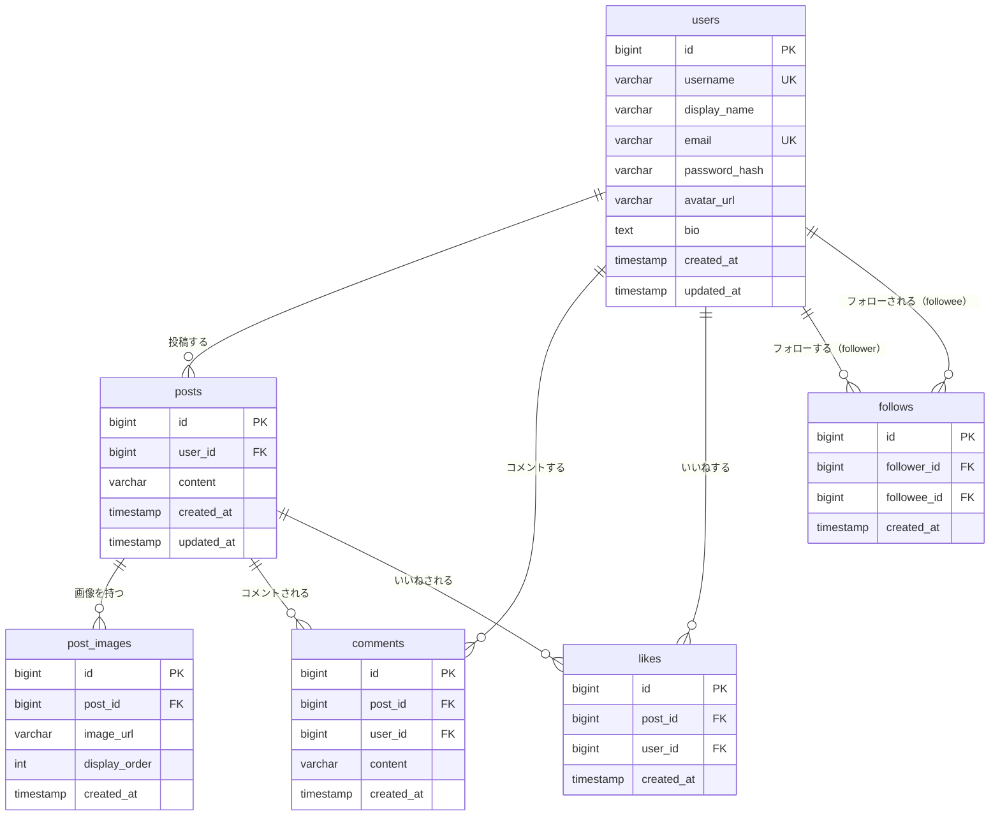

# データベース設計

## 1. ER 図

---

## 2. テーブル定義

### 2-1. users（ユーザー）

| カラム名 | 型 | 制約 | 備考 |
|---|---|---|---|
| id | BIGSERIAL | PRIMARY KEY | |
| username | VARCHAR(20) | NOT NULL, UNIQUE | 英数字とアンダースコアのみ |
| display_name | VARCHAR(50) | NOT NULL | 表示名 |
| email | VARCHAR(255) | NOT NULL, UNIQUE | |
| password_hash | VARCHAR(255) | NOT NULL | BCrypt ハッシュ |
| avatar_url | VARCHAR(500) | NULL | S3 の URL |
| bio | TEXT | NULL | 自己紹介（160 文字以内） |
| created_at | TIMESTAMP | NOT NULL, DEFAULT NOW() | |
| updated_at | TIMESTAMP | NOT NULL, DEFAULT NOW() | |

---

### 2-2. posts（投稿）

| カラム名 | 型 | 制約 | 備考 |
|---|---|---|---|
| id | BIGSERIAL | PRIMARY KEY | |
| user_id | BIGINT | NOT NULL, FOREIGN KEY → users(id) | ON DELETE CASCADE |
| content | VARCHAR(280) | NOT NULL | 投稿テキスト（1〜280 文字） |
| created_at | TIMESTAMP | NOT NULL, DEFAULT NOW() | |
| updated_at | TIMESTAMP | NULL | 編集時に更新（未編集は NULL） |

**インデックス:**
- `idx_posts_user_id` ON `posts(user_id)`
- `idx_posts_created_at` ON `posts(created_at DESC)` ← タイムライン取得用

---

### 2-3. post_images（投稿画像）

| カラム名 | 型 | 制約 | 備考 |
|---|---|---|---|
| id | BIGSERIAL | PRIMARY KEY | |
| post_id | BIGINT | NOT NULL, FOREIGN KEY → posts(id) | ON DELETE CASCADE |
| image_url | VARCHAR(500) | NOT NULL | S3 の URL |
| display_order | INT | NOT NULL | 表示順序（0〜3） |
| created_at | TIMESTAMP | NOT NULL, DEFAULT NOW() | |

**インデックス:**
- `idx_post_images_post_id` ON `post_images(post_id)`

---

### 2-4. comments（コメント）

| カラム名 | 型 | 制約 | 備考 |
|---|---|---|---|
| id | BIGSERIAL | PRIMARY KEY | |
| post_id | BIGINT | NOT NULL, FOREIGN KEY → posts(id) | ON DELETE CASCADE |
| user_id | BIGINT | NOT NULL, FOREIGN KEY → users(id) | ON DELETE CASCADE |
| content | VARCHAR(280) | NOT NULL | コメントテキスト（1〜280 文字） |
| created_at | TIMESTAMP | NOT NULL, DEFAULT NOW() | |

**インデックス:**
- `idx_comments_post_id` ON `comments(post_id)`

---

### 2-5. likes（いいね）

| カラム名 | 型 | 制約 | 備考 |
|---|---|---|---|
| id | BIGSERIAL | PRIMARY KEY | |
| post_id | BIGINT | NOT NULL, FOREIGN KEY → posts(id) | ON DELETE CASCADE |
| user_id | BIGINT | NOT NULL, FOREIGN KEY → users(id) | ON DELETE CASCADE |
| created_at | TIMESTAMP | NOT NULL, DEFAULT NOW() | |

**制約:**
- UNIQUE(`post_id`, `user_id`) ← 同一ユーザーの二重いいね防止

**インデックス:**
- `idx_likes_post_id` ON `likes(post_id)`
- `idx_likes_user_id` ON `likes(user_id)`

---

### 2-6. follows（フォロー）

| カラム名 | 型 | 制約 | 備考 |
|---|---|---|---|
| id | BIGSERIAL | PRIMARY KEY | |
| follower_id | BIGINT | NOT NULL, FOREIGN KEY → users(id) | フォローするユーザー、ON DELETE CASCADE |
| followee_id | BIGINT | NOT NULL, FOREIGN KEY → users(id) | フォローされるユーザー、ON DELETE CASCADE |
| created_at | TIMESTAMP | NOT NULL, DEFAULT NOW() | |

**制約:**
- UNIQUE(`follower_id`, `followee_id`) ← 同一ユーザーへの二重フォロー防止
- CHECK(`follower_id <> followee_id`) ← 自己フォロー防止

**インデックス:**
- `idx_follows_follower_id` ON `follows(follower_id)`
- `idx_follows_followee_id` ON `follows(followee_id)`

---

## 3. リレーション一覧

| リレーション | 種別 | 説明 |
|---|---|---|
| users → posts | 1:N | 1 ユーザーが複数の投稿を持つ |
| users → comments | 1:N | 1 ユーザーが複数のコメントを持つ |
| users → likes | 1:N | 1 ユーザーが複数の投稿にいいねできる |
| posts → post_images | 1:N | 1 投稿に最大 4 枚の画像を持つ |
| posts → comments | 1:N | 1 投稿に複数のコメントが付く |
| posts → likes | 1:N | 1 投稿に複数のいいねが付く |
| users ↔ users（follows） | N:M | ユーザー間のフォロー関係（自己参照） |
