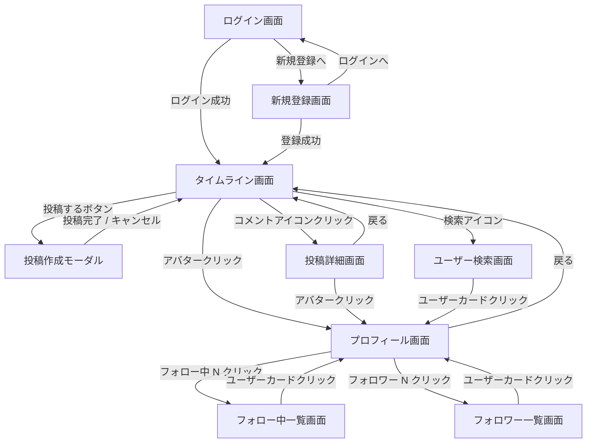

# 画面設計

## 1. 画面一覧

| # | 画面名 | URL（想定） | 認証要否 | 関連機能 |
|---|---|---|---|---|
| 1 | ログイン画面 | `/login` | 不要 | ログイン・認証 |
| 2 | 新規登録画面 | `/register` | 不要 | ログイン・認証 |
| 3 | タイムライン画面（ホーム） | `/` | 必要 | タイムライン・投稿・いいね・コメント数表示 |
| 4 | 投稿作成モーダル | `/`（モーダル） | 必要 | タイムライン・投稿・画像投稿 |
| 5 | 投稿詳細画面 | `/posts/{postId}` | 必要 | コメント・いいね・画像表示 |
| 6 | プロフィール画面 | `/users/{username}` | 必要 | ログイン・認証・フォロー |
| 7 | ユーザー検索画面 | `/search` | 必要 | フォロー・フォロワー |
| 8 | フォロー中一覧画面 | `/users/{username}/following` | 必要 | フォロー・フォロワー |
| 9 | フォロワー一覧画面 | `/users/{username}/followers` | 必要 | フォロー・フォロワー |

---

## 2. 画面遷移図



---

## 3. 各画面ワイヤーフレーム

### 3-1. ログイン画面

```
┌─────────────────────────────────────────┐
│                                         │
│           RAISETIMELINE                 │
│                                         │
│  ┌───────────────────────────────────┐  │
│  │ メールアドレス                    │  │
│  └───────────────────────────────────┘  │
│  ┌───────────────────────────────────┐  │
│  │ パスワード                        │  │
│  └───────────────────────────────────┘  │
│                                         │
│  ┌───────────────────────────────────┐  │
│  │           ログイン                │  │
│  └───────────────────────────────────┘  │
│                                         │
│  アカウントをお持ちでない方は            │
│  [新規登録はこちら]                     │
│                                         │
└─────────────────────────────────────────┘
```

**UI 要素:**

| 要素 | 内容 |
|---|---|
| メールアドレス入力 | type=email、必須 |
| パスワード入力 | type=password、必須 |
| ログインボタン | 認証成功でタイムライン画面へ遷移 |
| 新規登録リンク | 新規登録画面へ遷移 |
| エラーメッセージ | 認証失敗時にフォーム上部に表示 |

---

### 3-2. 新規登録画面

```
┌─────────────────────────────────────────┐
│                                         │
│           RAISETIMELINE                 │
│           アカウント作成                 │
│                                         │
│  ┌───────────────────────────────────┐  │
│  │ ユーザー名（@username）            │  │
│  └───────────────────────────────────┘  │
│  ┌───────────────────────────────────┐  │
│  │ 表示名                            │  │
│  └───────────────────────────────────┘  │
│  ┌───────────────────────────────────┐  │
│  │ メールアドレス                    │  │
│  └───────────────────────────────────┘  │
│  ┌───────────────────────────────────┐  │
│  │ パスワード（8文字以上）            │  │
│  └───────────────────────────────────┘  │
│                                         │
│  ┌───────────────────────────────────┐  │
│  │           登録する                │  │
│  └───────────────────────────────────┘  │
│                                         │
│  すでにアカウントをお持ちの方は          │
│  [ログインはこちら]                     │
│                                         │
└─────────────────────────────────────────┘
```

**UI 要素:**

| 要素 | 内容 |
|---|---|
| ユーザー名入力 | 3〜20 文字、英数字とアンダースコアのみ、ユニーク |
| 表示名入力 | 1〜50 文字 |
| メールアドレス入力 | type=email、ユニーク |
| パスワード入力 | type=password、8 文字以上 |
| 登録するボタン | 登録成功でタイムライン画面へ遷移 |
| ログインリンク | ログイン画面へ遷移 |

---

### 3-3. タイムライン画面（ホーム）

```
┌─────────────────────────────────────────────────────────────────────┐
│ [🏠] RAISETIMELINE        [🔍 ユーザーを検索]        [👤 @username ▼]│
├─────────────────────────────────────────────────────────────────────┤
│  [ 全体 ]  [ フォロー中 ]                                           │
├─────────────────────────────────────────────────────────────────────┤
│                                                                     │
│  ┌───────────────────────────────────────────────────────────────┐  │
│  │ [avatar] 表示名 @username · 2026-05-18 15:30                  │  │
│  │                                               ［ … ］         │  │
│  │ 投稿のテキスト内容がここに表示されます。                        │  │
│  │ 最大 280 文字の本文が続きます。                                 │  │
│  │                                                               │  │
│  │ ┌──────────┬──────────┐                                       │  │
│  │ │  画像1   │  画像2   │  ← 画像添付時のみ表示                 │  │
│  │ ├──────────┼──────────┤                                       │  │
│  │ │  画像3   │  画像4   │                                       │  │
│  │ └──────────┴──────────┘                                       │  │
│  │                                                               │  │
│  │  ♡ 12       💬 3                                              │  │
│  └───────────────────────────────────────────────────────────────┘  │
│                                                                     │
│  ┌───────────────────────────────────────────────────────────────┐  │
│  │ [avatar] 表示名 @username · 2026-05-18 14:20                  │  │
│  │                                                               │  │
│  │ 別の投稿のテキスト内容。                                       │  │
│  │                                                               │  │
│  │  ♥ 5        💬 1                                              │  │
│  └───────────────────────────────────────────────────────────────┘  │
│                                                                     │
│              ［ さらに読み込む ］                                    │
│                                                                     │
├─────────────────────────────────────────────────────────────────────┤
│                          ［ ＋ 投稿する ］                           │
└─────────────────────────────────────────────────────────────────────┘
```

**UI 要素:**

| 要素 | 内容 |
|---|---|
| ナビゲーションバー | ホームロゴ・検索バー・ユーザーメニュー（ログアウト） |
| タブ（全体 / フォロー中） | クリックで表示する投稿を切り替え、選択中タブをアクティブ表示 |
| 投稿カード | アバター・表示名・@username・日時・本文・画像グリッド・いいね数・コメント数 |
| いいねボタン（♡） | クリックでいいね / 取り消し（いいね済みは ♥ 赤色） |
| コメントアイコン（💬） | クリックで投稿詳細画面へ遷移 |
| 「…」メニュー | 自分の投稿のみ表示（編集・削除オプション） |
| さらに読み込むボタン | 次ページ 20 件を追加表示 |
| 投稿するボタン | 投稿作成モーダルを開く |

---

### 3-4. 投稿作成モーダル

```
┌───────────────────────────────────────────────────────┐
│  新規投稿                                      ［ × ］ │
├───────────────────────────────────────────────────────┤
│                                                       │
│  [avatar]                                             │
│  ┌─────────────────────────────────────────────────┐  │
│  │                                                 │  │
│  │ いまどうしてる？（最大 280 文字）               │  │
│  │                                                 │  │
│  └─────────────────────────────────────────────────┘  │
│                                                       │
│  ┌──────┬──────┐                                      │
│  │ 画像1 │ 画像2 │  ← 選択した画像のプレビュー       │
│  └──────┴──────┘     （各画像に × ボタン）           │
│                                                       │
│  [📷 画像を追加]                     250 / 280        │
│                                                       │
│                              ┌──────────────────────┐ │
│                              │        投稿           │ │
│                              └──────────────────────┘ │
└───────────────────────────────────────────────────────┘
```

**UI 要素:**

| 要素 | 内容 |
|---|---|
| テキストエリア | 最大 280 文字、プレースホルダーあり |
| 文字数カウンター | 入力文字数 / 280 をリアルタイム表示 |
| 画像追加ボタン | ファイル選択ダイアログを開く |
| 画像プレビュー | 選択画像を最大 4 枚表示（各画像に × で削除） |
| 投稿ボタン | テキストまたは画像がある場合のみアクティブ |
| × ボタン | モーダルを閉じる |

---

### 3-5. 投稿詳細画面

```
┌─────────────────────────────────────────────────────────────────────┐
│ ← 戻る    投稿                                                      │
├─────────────────────────────────────────────────────────────────────┤
│                                                                     │
│  [avatar] 表示名 @username                                          │
│  2026-05-18 15:30                                     ［ … ］       │
│                                                                     │
│  投稿のテキスト内容がここに表示されます。                             │
│                                                                     │
│  ┌──────────┬──────────┐                                            │
│  │  画像1   │  画像2   │                                            │
│  ├──────────┼──────────┤                                            │
│  │  画像3   │  画像4   │                                            │
│  └──────────┴──────────┘                                            │
│                                                                     │
│  ♡ 12  💬 3                                                         │
│                                                                     │
├─────────────────────────────────────────────────────────────────────┤
│  コメント（3 件）                                                    │
│                                                                     │
│  [avatar] 表示名 @username · 2026-05-18 15:35         ［削除］      │
│  コメントの内容がここに表示されます。                                 │
│                                                                     │
│  [avatar] 表示名 @username · 2026-05-18 15:40                       │
│  別のユーザーのコメント。                                             │
│                                                                     │
├─────────────────────────────────────────────────────────────────────┤
│  [avatar]                                                           │
│  ┌───────────────────────────────────────────────────────────────┐  │
│  │ コメントを入力...（最大 280 文字）                              │  │
│  └───────────────────────────────────────────────────────────────┘  │
│                                          ［ コメントする ］          │
└─────────────────────────────────────────────────────────────────────┘
```

**UI 要素:**

| 要素 | 内容 |
|---|---|
| 戻るボタン | タイムライン画面へ戻る |
| 投稿詳細 | 投稿カードと同じ情報（いいねボタン含む） |
| 「…」メニュー | 自分の投稿のみ表示（編集・削除オプション） |
| コメント一覧 | 古い順（created_at ASC）、自分のコメントには削除ボタン |
| コメント入力フォーム | テキストエリア + 「コメントする」ボタン |

---

### 3-6. プロフィール画面

```
┌─────────────────────────────────────────────────────────────────────┐
│ ← 戻る    @username                                                 │
├─────────────────────────────────────────────────────────────────────┤
│                                                                     │
│  [                    アバター画像（大）                    ]        │
│                                                                     │
│  表示名                                                             │
│  @username                                                          │
│  自己紹介テキストが表示されます。                                     │
│                                                                     │
│  フォロー中: 120    フォロワー: 340                                  │
│                                                                     │
│  ┌────────────────────┐                                             │
│  │ プロフィールを編集  │  ← 自分のプロフィールの場合                 │
│  └────────────────────┘                                             │
│  ┌────────────────────┐                                             │
│  │    フォローする     │  ← 他ユーザーのプロフィールの場合           │
│  └────────────────────┘                                             │
│                                                                     │
├─────────────────────────────────────────────────────────────────────┤
│  投稿                                                               │
├─────────────────────────────────────────────────────────────────────┤
│  ┌───────────────────────────────────────────────────────────────┐  │
│  │ [avatar] 表示名 @username · 2026-05-18 15:30                  │  │
│  │ 自分の投稿が一覧表示されます。                                  │  │
│  │  ♡ 12       💬 3                                              │  │
│  └───────────────────────────────────────────────────────────────┘  │
│                                                                     │
└─────────────────────────────────────────────────────────────────────┘
```

**UI 要素:**

| 要素 | 内容 |
|---|---|
| アバター | ユーザーのアバター画像（大サイズ） |
| 表示名・@username | プロフィール情報 |
| 自己紹介 | bio テキスト |
| フォロー中数 | クリックでフォロー中一覧画面へ遷移 |
| フォロワー数 | クリックでフォロワー一覧画面へ遷移 |
| プロフィールを編集 | 自分のプロフィールのみ表示、編集モーダルを開く |
| フォローする / フォロー中 | 他ユーザーのプロフィールに表示 |
| 投稿一覧 | そのユーザーの投稿のみを新着順に表示 |

---

### 3-7. ユーザー検索画面

```
┌─────────────────────────────────────────────────────────────────────┐
│ ← 戻る    ユーザーを検索                                             │
├─────────────────────────────────────────────────────────────────────┤
│                                                                     │
│  ┌───────────────────────────────────────────────────────────────┐  │
│  │ 🔍  ユーザー名または表示名で検索...                            │  │
│  └───────────────────────────────────────────────────────────────┘  │
│                                                                     │
│  ┌───────────────────────────────────────────────────────────────┐  │
│  │ [avatar]  表示名            ┌──────────────┐                  │  │
│  │           @username        │  フォローする  │                  │  │
│  └───────────────────────────────────────────────────────────────┘  │
│  ┌───────────────────────────────────────────────────────────────┐  │
│  │ [avatar]  表示名            ┌──────────────┐                  │  │
│  │           @username        │   フォロー中  │  ← いいね済み    │  │
│  └───────────────────────────────────────────────────────────────┘  │
│                                                                     │
└─────────────────────────────────────────────────────────────────────┘
```

**UI 要素:**

| 要素 | 内容 |
|---|---|
| 検索バー | ユーザー名 / 表示名で部分一致検索、300ms デバウンス |
| ユーザーカード | アバター・表示名・@username・フォローボタン |
| フォローする | 未フォロー状態のボタン |
| フォロー中 | フォロー済み状態のボタン（クリックでフォロー解除） |
| 結果なし | 「ユーザーが見つかりませんでした」メッセージを表示 |

---

### 3-8. フォロー中一覧画面

```
┌─────────────────────────────────────────────────────────────────────┐
│ ← 戻る    フォロー中                                                 │
├─────────────────────────────────────────────────────────────────────┤
│                                                                     │
│  ┌───────────────────────────────────────────────────────────────┐  │
│  │ [avatar]  表示名            ┌──────────────┐                  │  │
│  │           @username        │   フォロー中  │                  │  │
│  └───────────────────────────────────────────────────────────────┘  │
│  ┌───────────────────────────────────────────────────────────────┐  │
│  │ [avatar]  表示名            ┌──────────────┐                  │  │
│  │           @username        │   フォロー中  │                  │  │
│  └───────────────────────────────────────────────────────────────┘  │
│                                                                     │
└─────────────────────────────────────────────────────────────────────┘
```

**UI 要素:**

| 要素 | 内容 |
|---|---|
| ユーザーカード | アバター・表示名・@username・フォロー中ボタン |
| フォロー中ボタン | クリックでフォロー解除 |
| カードクリック | プロフィール画面へ遷移 |

---

### 3-9. フォロワー一覧画面

```
┌─────────────────────────────────────────────────────────────────────┐
│ ← 戻る    フォロワー                                                 │
├─────────────────────────────────────────────────────────────────────┤
│                                                                     │
│  ┌───────────────────────────────────────────────────────────────┐  │
│  │ [avatar]  表示名            ┌──────────────┐                  │  │
│  │           @username        │  フォローする  │                  │  │
│  └───────────────────────────────────────────────────────────────┘  │
│  ┌───────────────────────────────────────────────────────────────┐  │
│  │ [avatar]  表示名            ┌──────────────┐                  │  │
│  │           @username        │   フォロー中  │  ← 相互フォロー  │  │
│  └───────────────────────────────────────────────────────────────┘  │
│                                                                     │
└─────────────────────────────────────────────────────────────────────┘
```

**UI 要素:**

| 要素 | 内容 |
|---|---|
| ユーザーカード | アバター・表示名・@username・フォローボタン |
| フォローする / フォロー中 | ログインユーザーのフォロー状態に応じて切り替え |
| カードクリック | プロフィール画面へ遷移 |
